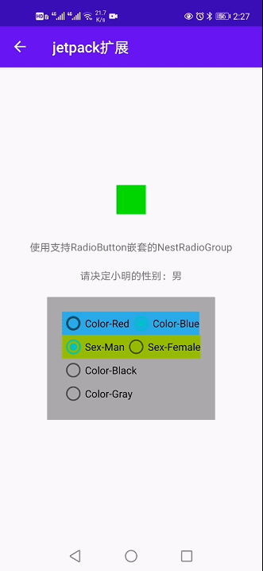

# jetpack-expand
基于安卓Jetpack框架组件，在安卓应用开发上的一些辅助类和工具

## 导入依赖

```gradle
    implementation 'com.github.icebuf:jetpack-ex:0.0.5'
```

## 万能RecyclerView适配器

这次真的不用再写adapter了

1. 界面布局文件
```xml
<androidx.recyclerview.widget.RecyclerView
    android:layout_width="match_parent"
    android:layout_height="match_parent"
    app:adapterDataSet="@{vm.testList}" 
    app:adapterTag="@{vm}"
    app:onItemClick="@{(view, item, pos)->vm.onItemClick(item, pos)}"
    app:layoutManager="androidx.recyclerview.widget.LinearLayoutManager"/>
```

|         attr         |         类型         |       功能       |              备注              |
|:--------------------:|:-------------------:|:---------------:|:------------------------------:|
| `app:adapterDataSet` |      `List<?>`      |   填充的数据列表   | 支持`ObservableList`类型自动刷新 |
|   `app:adapterTag`   |      `Object`       | 传递到Item中的数据 |                               |
|  `app:onItemClick`   |       method        |   Item点击回调    |                               |
| `app:layoutManager`  | LinearLayoutManager |    布局管理器     |          Android自带           |

2. Item布局文件
```xml
<layout xmlns:android="http://schemas.android.com/apk/res/android">
    <data>
        <variable
            name="item"
            type="com.icebuf.jetpackex.sample.pojo.TestItem" />
    </data>
    <LinearLayout
        android:layout_width="match_parent"
        android:layout_height="wrap_content"
        android:orientation="vertical"
        android:padding="10dp">

        <TextView
            android:layout_width="wrap_content"
            android:layout_height="wrap_content"
            android:text="@{item.name}"/>

        <TextView
            android:layout_width="wrap_content"
            android:layout_height="wrap_content"
            android:text="@{item.description}"
            android:layout_marginTop="10dp"/>

    </LinearLayout>
</layout>
```

3. Item绑定
- 方式一：通过注解绑定Item布局
```java
@RecyclerViewItem(layoutId = R.layout.item, variableId = BR.item)
public class TestItem {
    
    String name;
    String description;
}
```
- 方式二：通过实现接口绑定Item布局
```java

public class TestItem implements RecyclerViewAdapter.BindingItem {
    
    String name;
    String description;
    
    @Override
    public int getViewType() {
        return R.layout.item;
    }

    @Override
    public int getVariableId() {
        return BR.item;
    }

    @Override
    public int getTagId() {
        return BR.tag;
    }
}
```

## RadioGroup和RadioButton

- 不需要继承RadioGroup和RadioButton类去拓展此功能
- 支持基本类型，枚举，Object数据绑定

通过颜色值绑定
```xml
<layout>
    <data>
        <variable name="vm"
            type="xxx.xxx.ViewModel" />
    </data>
    <RadioGroup
        app:checkedValue="@{@color/red}"
        app:onValueChanged="@{(view, value)->vm.onColorChanged(view, value)}">
        <RadioButton
            app:value="@{@color/red}"
            android:text="Red" />
        <RadioButton
            app:value="@{@color/Blue}"
            android:text="Blue" />    
    </RadioGroup>   
</layout>
```
通过枚举绑定
```xml
<layout>
    <data>
        <import type="xxx.xxx.Sex" />
        <variable name="vm"
            type="xxx.xxx.ViewModel" />
    </data>
    <RadioGroup
        app:checkedValue="@{Sex.MAM}"
        app:onValueChanged="@{(view, value)->vm.onSexChanged(view, value)}">
        <RadioButton
            app:value="@{Sex.MAM}"
            android:text="Man" />
        <RadioButton
            app:value="@{Sex.FEMALE}"
            android:text="Female" />    
    </RadioGroup>  
</layout>
```
注意：同一个RadioGroup中所有RadioButton的绑定`app:value`的类型必须一致

## NestedRadioGroup

- 继承自LinearLayout而非RadioGroup
- 可在子布局中继续寻找可用的RadioButton
- 支持任意的布局方式排列但RadioButton

注意：如果NestedRadioGroup的子布局中又出现了一个NestedRadioGroup或者是RadioGroup
时，在检查RadioButton时会直接将其跳过，因为这个子布局可能有自己的`checkedChanged`事件的回调




